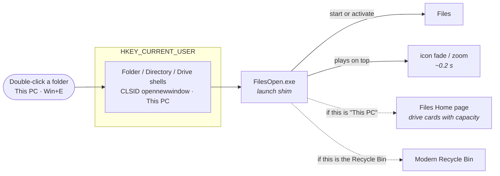

  

  
  
  
  
  

<h1 align="center">Files Companion</h1>

  <b>Brings the startup animation back to Files — and routes folders, drives, 
  This PC and Win+E through it.</b>

<h3 align="center">
  <a href="#-installation">Installation</a>
   · 
  <a href="#-what-it-does">What it does</a>
   · 
  <a href="#-how-it-works">How it works</a>
   · 
  <a href="#-troubleshooting">Troubleshooting</a>
   · 
  <a href="README.zh-CN.md">简体中文</a>
</h3>

---

## 📦 What it does

[Files](https://github.com/files-community/Files) is a modern file manager for
Windows. To make folders open instantly it keeps itself **resident in the
background**, which has one visible side effect: opening a folder only
*activates* the already-running process, so **Windows skips the startup
animation** and the window seems to appear out of nowhere.

**Files Companion** adds a thin layer in front of Files that puts the animation
back — without giving up the residency that makes Files fast.

| | What it adds |
|---|---|
| 🎬 | **Launch animation** — Files opens with the same icon fade/zoom Windows uses for a freshly started app |
| 🧭 | **Smart routing** — folders, drives, "This PC" and `Win+E` all open in Files instead of Explorer |
| 🏠 | **The right landing page** — "This PC" and `Win+E` land on Files' **Home** page, which shows drive cards with capacity bars; the plain "This PC" page cannot draw those |
| 🗑️ | **Recycle Bin link** — optionally hands the Recycle Bin to [Modern Recycle Bin](https://github.com/Dannyzzy/Modern-Recycle-Bin), so both tools work as one set |
| ↩️ | **Fully reversible** — everything lives in `HKEY_CURRENT_USER`; uninstall restores the defaults |

> **This is not a Files plugin.** Files is a self-contained WinUI application with
> no plugin or extension API — verified by searching its source for `IPlugin`,
> `PluginManager`, `ExtensionHost`, `ShellIntegration` and `RegisterAsDefault`,
> all of which return nothing. Files Companion therefore ships as a **companion
> tool** that sits beside Files rather than inside it.

## 🖼️ Screenshots

**The installer** — two checkboxes, no administrator rights, and an uninstall
that puts everything back.

  

## 🚀 Installation

1. Download **`FilesCompanionSetup.exe`** from the
   [latest release](https://github.com/Dannyzzy/Files-Companion/releases/latest).
2. Run it — **no administrator rights required**.
3. Choose what you want:
   - **Enable the launch animation and smart routing** — folders, drives,
     "This PC" and `Win+E` open in Files, with the animation restored.
   - **Let the Recycle Bin use Modern Recycle Bin** — if that app is not installed
     yet, this installer fetches and installs it silently (and opens its download
     page if the download fails).
4. Done. Double-click any folder.

**To uninstall:** run `Uninstall.cmd` inside
`%LOCALAPPDATA%\FilesCompanion`, or `%LOCALAPPDATA%\FilesCompanion-Uninstall.exe`.
Uninstalling removes the redirects, restores the default open behaviour, and
deletes the program folder.

### Requirements

- **Windows 10 or 11, 64-bit**
- **[Files](https://apps.microsoft.com/detail/9nghp3dx8hdx)** installed and set up,
  ideally with **"Set Files as default file manager"** enabled in its advanced
  settings — Files Companion then adds the animation and the extra routing on top
- Anyone who prefers the portable route can simply take `FilesOpen.exe` from the
  release and point the registry keys at it themselves (see *How it works*)

## 🔧 How it works

**The redirects it writes** (all under `HKEY_CURRENT_USER`, no admin rights):

| Registry key | Value |
|---|---|
| `SOFTWARE\Classes\Folder\shell\open\command` | `"…\FilesOpen.exe" "%1"` |
| `SOFTWARE\Classes\Folder\shell\explore\command` | `"…\FilesOpen.exe" "%1"` |
| `SOFTWARE\Classes\Folder\shell\OpenWithFiles\command` | `"…\FilesOpen.exe" "%1"` |
| `SOFTWARE\Classes\Directory\shell\OpenWithFiles\command` | `"…\FilesOpen.exe" "%1"` |
| `SOFTWARE\Classes\Drive\shell\OpenWithFiles\command` | `"…\FilesOpen.exe" "%1"` |
| `SOFTWARE\Classes\CLSID\{52205fd8-…}\shell\opennewwindow\command` | `"…\FilesOpen.exe"` (Win+E) |
| `SOFTWARE\Classes\CLSID\{20D04FE0-…}\shell\open\command` | `"…\FilesOpen.exe"` (This PC) |
| `SOFTWARE\Classes\CLSID\{645FF040-…}\shell\open\command` | `"…\ModernRecycleBin\RecycleBin.exe"` (optional) |

The keys that Explorer also handles get `DelegateExecute=""` so the built-in
delegate cannot take over again.

**Why the shim exists at all.** With Files resident, a direct launch is just a
process activation and Windows has nothing to animate. The shim starts Files the
normal way and then plays a short layered-window animation itself (120 px icon,
scale 0.92 → 1.00 → 1.06, about 0.21 s), which is what makes the window feel like
it is opening rather than appearing.

**Two safety rules this project follows**, learned from shipping the companion
Recycle Bin app:

- The **uninstaller lives next to the install folder**, never inside it — Windows
  will not let a running executable delete its own folder.
- Uninstall removes a registry value **only when it still points at this
  install's exact path**. If you have your own `FilesOpen.exe` somewhere else, its
  configuration is left untouched.

## ❓ Troubleshooting

<b>Folders still open in Explorer</b>

Make sure Files is installed and that you let the installer tick the routing
option. Restarting Explorer is not required for new windows, but already-open
Explorer windows keep their old behaviour.

<b>I do not want the animation, only the routing</b>

The animation is drawn by the shim itself, so routing and animation come as one
piece. If you want Files' own routing without any shim, leave this project out
and use **Files → Settings → Advanced → Set Files as default file manager**
instead; Files Companion exists precisely because that route loses the startup
animation once Files is resident.

<b>How do I undo everything?</b>

Run `Uninstall.cmd` in `%LOCALAPPDATA%\FilesCompanion`. It deletes the registry
values listed above, removes the folder, and deletes itself. Nothing else on the
system is touched.

<b>Does it work without Files?</b>

The shim falls back to launching Files' own launcher if it can find it; without
Files installed the redirects would have nothing to open, so install Files first.

## 🤝 Contributing

Issues and pull requests are welcome. Please include your Windows version, the
Files version, and which of the redirects misbehaves.

## 📄 License

Released under the [MIT License](LICENSE).

Files itself is a separate project by the
[Files community](https://github.com/files-community/Files) and is licensed
MIT/MPL. Files Companion contains **no code or assets from Files** — it only
starts it and redirects shell verbs to it.

## 🔗 See also

**[Modern Recycle Bin](https://github.com/Dannyzzy/Modern-Recycle-Bin)** — a Recycle
Bin for Windows 11 with image previews, restore-anywhere and copy-out. Files
Companion can install and wire it up for you.
