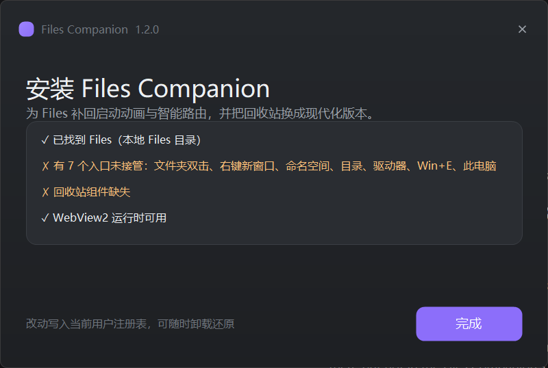
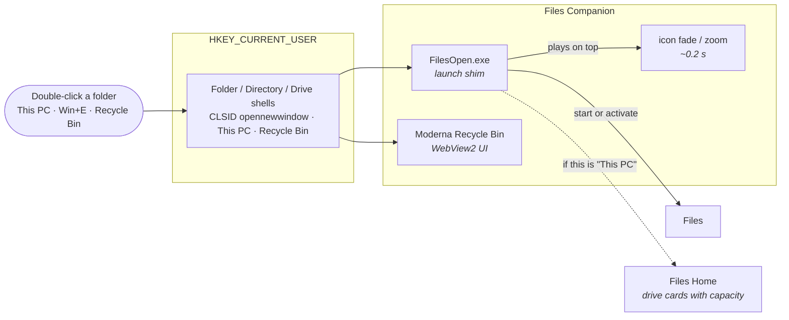

<p align="center">
  
</p>

<p align="center">
  <a href="https://github.com/Dannyzzy/Files-Companion/releases/latest"></a>
  <a href="https://github.com/Dannyzzy/Files-Companion/releases"></a>
  <a href="LICENSE"></a>
  <a href="#requirements"></a>
  <a href="https://github.com/Dannyzzy/Files-Companion/actions/workflows/build.yml"></a>
</p>

<h1 align="center">Files Companion</h1>

<p align="center">
  <b>The all-in-one companion set for the Files file manager.</b><br/>
  Launch animation · smart routing · a modern Recycle Bin — one file, one click.
</p>

<h3 align="center">
  <a href="#-installation">Installation</a>
  <span> · </span>
  <a href="#-the-two-components">Components</a>
  <span> · </span>
  <a href="#-how-it-works">How it works</a>
  <span> · </span>
  <a href="#-troubleshooting">Troubleshooting</a>
  <span> · </span>
  <a href="README.zh-CN.md">简体中文</a>
</h3>

---

## 📦 What is this?

[Files](https://github.com/files-community/Files) is a modern file manager for
Windows. To make folders open instantly it keeps itself **resident in the
background**, which has one visible side effect: opening a folder only
*activates* the already-running process, so **Windows skips the startup
animation** and the window seems to appear out of nowhere.

Files Companion is the small set of extras that makes Files feel finished:

| | Component | What it does |
|---|---|---|
| 🎬 | **Files enhancement layer** | Puts the startup animation back, and routes folders, drives, "This PC" and `Win+E` through Files |
| 🗑️ | **[Modern Recycle Bin](https://github.com/Dannyzzy/Modern-Recycle-Bin)** | Replaces the Recycle Bin with one that previews images, restores anywhere and copies files out |

Both are built for the Files workflow, so they ship together — **one 262 KB
installer, no network access, no administrator rights**, and uninstalling
restores the defaults.

> **This is not a Files plugin.** Files is a self-contained WinUI application with
> no plugin or extension API — verified by searching its source for `IPlugin`,
> `PluginManager`, `ExtensionHost`, `ShellIntegration` and `RegisterAsDefault`,
> all of which return nothing. Files Companion therefore ships as a **companion
> tool** that sits beside Files rather than inside it, and contains **no Files
> code or assets**.

## 🖼️ Screenshots

### Quick start

1. **Install** — run `FilesCompanionSetup.exe`, leave both boxes ticked, click
   **一键安装**.
2. **Read the report** — the same window then lists what was detected on your
   machine. Every line marked ✓ is working; anything marked ✗ says what to do.

   

3. **Use it** — double-click any folder, press `Win+E`, or open the Recycle Bin.

You can run the check again at any time without installing anything:

```
FilesCompanionSetup.exe --verify
```

**The installer** — two components, and the details of both are still optional.

<p align="center">
  
</p>

**The Recycle Bin** that comes with it — image previews, restore anywhere, copy
out, filter by type, Windows 11 styling.


## 🚀 Installation

1. Download **`FilesCompanionSetup.exe`** from the
   [latest release](https://github.com/Dannyzzy/Files-Companion/releases/latest).
2. Run it — **no administrator rights required**.
3. Untick anything you do not want, then click install.
4. Done. Double-click any folder, press `Win+E`, or open the Recycle Bin.

**To uninstall:** run `Uninstall.cmd` inside `%LOCALAPPDATA%\FilesCompanion`, or
`%LOCALAPPDATA%\FilesCompanion-Uninstall.exe`. It removes the redirects, restores
the default open behaviour for folders and the Recycle Bin, and deletes both
component folders.

<a name="requirements"></a>
### Requirements

- **Windows 10 or 11, 64-bit**
- **[Files](https://apps.microsoft.com/detail/9nghp3dx8hdx)** installed — ideally
  with **Settings → Advanced → Set Files as default file manager** enabled. Files
  Companion then adds the animation and the extra routing on top.
- The Recycle Bin component needs the **WebView2 Runtime**, which is preinstalled
  on Windows 11 and current Windows 10 builds. The installer tells you if it is
  missing.

## 🧩 The two components

### Files enhancement layer

- **Launch animation** — Files opens with the icon fade/zoom Windows normally
  plays for a freshly started app, instead of just appearing
- **Smart routing** — folders, drives, "This PC" and `Win+E` open in Files
  instead of Explorer
- **The right landing page** — "This PC" and `Win+E` land on Files' **Home**, which
  shows drive cards with capacity bars; the plain "This PC" page cannot draw those

### Modern Recycle Bin

- **Restore anywhere** — pick any folder, not only the original location
- **Copy out** — take a copy while keeping the original in the bin
- **Image previews** — see a thumbnail before restoring
- **Filter by type** and search over name, original path and type
- **Conflict handling** — overwrite, skip, or keep both
- **Windows 11 styling**, comfortable/compact density, `Ctrl`+scroll zoom

It is also available on its own at
[Modern-Recycle-Bin](https://github.com/Dannyzzy/Modern-Recycle-Bin).

## 🔧 How it works



**The registry values it writes** (all `HKEY_CURRENT_USER`, no admin rights):

| Registry key | Value |
|---|---|
| `SOFTWARE\Classes\Folder\shell\open\command` | `"…\FilesCompanion\FilesOpen.exe" "%1"` |
| `SOFTWARE\Classes\Folder\shell\explore\command` | same |
| `SOFTWARE\Classes\Folder\shell\OpenWithFiles\command` | same |
| `SOFTWARE\Classes\Directory\shell\OpenWithFiles\command` | same |
| `SOFTWARE\Classes\Drive\shell\OpenWithFiles\command` | same |
| `SOFTWARE\Classes\CLSID\{52205fd8-…}\shell\opennewwindow\command` | `"…\FilesOpen.exe"` (Win+E) |
| `SOFTWARE\Classes\CLSID\{20D04FE0-…}\shell\open\command` | `"…\FilesOpen.exe"` (This PC) |
| `SOFTWARE\Classes\CLSID\{645FF040-…}\shell\open\command` | `"…\ModernRecycleBin\RecycleBin.exe"` |

The keys Explorer also handles get `DelegateExecute=""` so the built-in delegate
cannot take over again.

**Why the shim exists at all.** With Files resident, a direct launch is just a
process activation and Windows has nothing to animate. The shim starts Files the
normal way and then plays a short layered-window animation itself (120 px icon,
scale 0.92 → 1.00 → 1.06, about 0.21 s), which is what makes the window feel like
it is opening rather than appearing.

**Three safety rules this project follows**, learned from shipping the companion
Recycle Bin app:

- The **uninstaller lives next to the install folders**, never inside them —
  Windows will not let a running executable delete its own folder.
- Uninstall removes a registry value **only when it still points at this exact
  install**, so a configuration you set up by hand is never clobbered.
- The bundled Recycle Bin is removed on uninstall **only when this installer put
  it there** (tracked with a marker file), so a copy you installed separately
  survives.

## 🛠️ Building from source

You need nothing but the .NET Framework compiler that ships with Windows.

```cmd
git clone https://github.com/Dannyzzy/Files-Companion.git
cd Files-Companion
build.cmd
```

`vendor\RecycleBin` holds the prebuilt Recycle Bin component; see
`vendor\README.md` and `scripts\refresh-vendor.ps1` for how to refresh it from the
sibling project.

```
dist\FilesOpen.exe             the launch shim (standalone)
dist\FilesCompanionSetup.exe   all-in-one installer (both components)
```

## ❓ Troubleshooting

<details>
<summary><b>Folders still open in Explorer</b></summary>

Make sure Files is installed and that you left the routing option ticked.
Explorer windows that are already open keep their old behaviour; new ones use
Files.
</details>

<details>
<summary><b>The Recycle Bin window is blank</b></summary>

That component renders its interface with the WebView2 Runtime. Windows 11 and
current Windows 10 include it; the installer warns you if it is missing and links
to Microsoft's official download.
</details>

<details>
<summary><b>How do I undo everything?</b></summary>

Run `Uninstall.cmd` in `%LOCALAPPDATA%\FilesCompanion`. It deletes the registry
values above, removes both component folders, and deletes itself. Nothing else on
the system is touched.
</details>

<details>
<summary><b>Windows SmartScreen warns me about the installer</b></summary>

The release binaries are not code-signed (a certificate costs money for an
open-source project). Choose **More info → Run anyway**, or build from source with
`build.cmd`.
</details>

## 🤝 Contributing

Issues and pull requests are welcome. Please include your Windows version, the
Files version, and which component misbehaves.

## 📄 License

Released under the [MIT License](LICENSE).

Files itself is a separate project by the
[Files community](https://github.com/files-community/Files), licensed MIT/MPL.
Files Companion contains no code or assets from Files — it only starts it and
redirects shell verbs to it. The bundled WebView2 runtime loader is Microsoft's,
under the terms in `vendor\RecycleBin\WebView2-LICENSE.txt`.

## ✅ Will it work on my machine?

The companion has to find Files, and Files can be installed in several ways — the
Microsoft Store build, the classic installer from GitHub, winget, scoop — each of
which puts its launcher somewhere different. Earlier versions probed two fixed
paths, so a machine with a different install silently did nothing when you
double-clicked a folder. That is fixed:

1. `%LOCALAPPDATA%\Files\Files.App.Launcher.exe` (classic installer)
2. **any** `files*.exe` execution alias in `%LOCALAPPDATA%\Microsoft\WindowsApps`
   — auto-detected, so `files-stable`, `files-preview` and future names all work
3. `%ProgramFiles%\Files\…` and `%ProgramFiles(x86)%\Files\…`
4. the AppX package root recorded by the Windows package repository
5. winget and scoop install trees
6. **if nothing matches, the folder opens in Explorer instead** — a working window
   rather than a dead double-click

### Check your own machine in five seconds

```
"%LOCALAPPDATA%\FilesCompanion\FilesOpen.exe" --doctor
```

A report opens in Notepad listing:

- which Files launcher was found, and by which strategy
- the state of all eight shell redirects (folders, drives, This PC, Win+E, Recycle Bin)
- whether the WebView2 Runtime is present for the Recycle Bin component
- a plain **Result** line saying whether the setup is ready

If it says *not ready*, send that report with your issue — it contains exactly
what is needed to see why.

### Honest limits

- **64-bit Windows only.** The binaries are x64; a 32-bit install cannot run them.
- **The interface is Simplified Chinese.** It renders correctly on any Windows
  (Microsoft YaHei ships with every SKU), but the text is Chinese; English strings
  are planned.
- **Not code-signed**, so SmartScreen may ask you to confirm the first run.
- The companion cannot create a Files installation: if Files is not installed at
  all, folder opens fall back to Explorer.