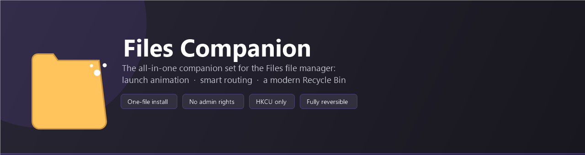
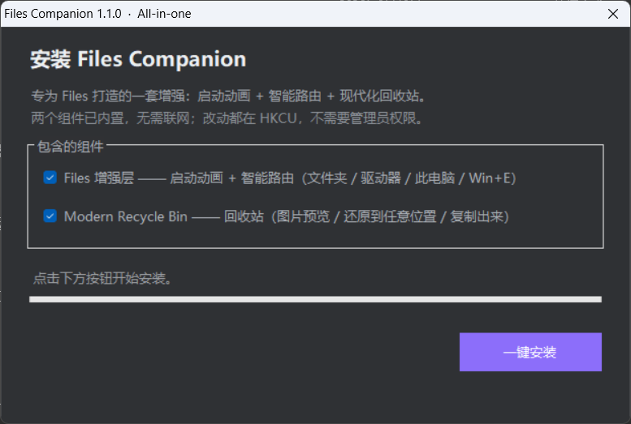
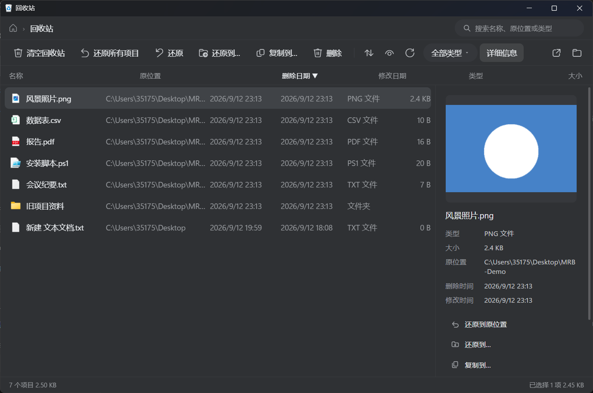
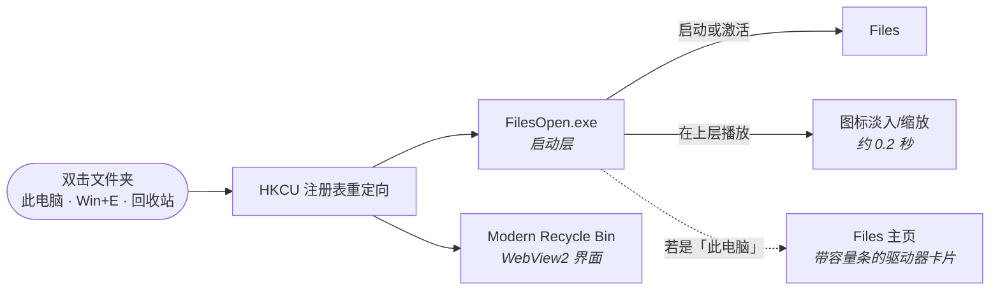

# Files Companion

**专为 [Files](https://github.com/files-community/Files) 文件管理器打造的一套增强，一个安装包装完。**

> English README: [README.md](README.md)



## 为什么需要它

Files 为了打开够快会**常驻后台**，副作用是：打开文件夹只是**激活已有进程**，
Windows 就**跳过启动动画**，窗口像是凭空出现。

Files Companion 就是让 Files 更完整的那几件小事：

| | 组件 | 作用 |
|---|---|---|
| 🎬 | **Files 增强层** | 补回启动动画；让文件夹、驱动器、此电脑、`Win+E` 都走 Files |
| 🗑️ | **Modern Recycle Bin** | 现代化回收站：图片预览、还原到任意位置、复制出来 |

两者都是为 Files 工作流设计的，所以**打包在一起**：
**一个 262 KB 安装包、无需联网、不需要管理员权限**，卸载即还原。

> **它不是 Files 插件。** Files 是自包含的 WinUI 应用，**没有插件接口** ——
> 我查过它源码里的 `IPlugin`、`PluginManager`、`ExtensionHost`、`ShellIntegration`、
> `RegisterAsDefault`，全部为 0。所以本项目以**配套工具**形式发布，
> 且**不含 Files 的任何代码或资源**。

## 截图

**安装器** —— 两个组件，都还能单独取消：



**随包安装的回收站** —— 图片预览、还原到任意位置、复制出来、按类型筛选：



## 安装

1. 到 [Releases](https://github.com/Dannyzzy/Files-Companion/releases/latest) 下载 `FilesCompanionSetup.exe`
2. 双击运行 —— **不需要管理员权限**
3. 不要的组件就取消勾选，点「一键安装」
4. 完成：双击文件夹、按 `Win+E`、或打开回收站试试

**卸载**：运行 `%LOCALAPPDATA%\FilesCompanion\Uninstall.cmd` ——
会移除重定向、恢复文件夹与回收站的默认行为、删除两个组件目录。

## 两个组件分别做什么

**Files 增强层**
- **启动动画** —— 恢复 Windows 那种图标淡入/缩放
- **智能路由** —— 文件夹、驱动器、此电脑、`Win+E` 都走 Files
- **落对页面** —— 此电脑 / `Win+E` 落到 Files **主页**（有容量条的驱动器卡片）

**Modern Recycle Bin**
- **还原到任意位置**（系统只能还原到原位置）
- **复制出来**（保留原件，系统做不到）
- **图片缩略图预览**、**按类型筛选**、**同名冲突三策略**（覆盖/跳过/保留两者）
- **Windows 11 风格**、舒适/紧凑行距、`Ctrl`+滚轮缩放

它也可以单独安装：[Modern-Recycle-Bin](https://github.com/Dannyzzy/Modern-Recycle-Bin)

## 工作原理



**写入的注册表项**（全部在 HKCU，不需要管理员）：

| 注册表键 | 值 |
|---|---|
| `Folder\shell\open\command` | `"…\FilesCompanion\FilesOpen.exe" "%1"` |
| `Folder\shell\explore\command` | 同上 |
| `Folder\shell\OpenWithFiles\command` | 同上 |
| `Directory\shell\OpenWithFiles\command` | 同上 |
| `Drive\shell\OpenWithFiles\command` | 同上 |
| `CLSID\{52205fd8-…}\shell\opennewwindow\command` | `"…\FilesOpen.exe"`（Win+E）|
| `CLSID\{20D04FE0-…}\shell\open\command` | `"…\FilesOpen.exe"`（此电脑）|
| `CLSID\{645FF040-…}\shell\open\command` | `"…\ModernRecycleBin\RecycleBin.exe"` |

## 三条安全准则

做配套回收站时踩坑总结出来的，本项目全部遵守：

1. **卸载器放在安装目录之外** —— Windows 不允许运行中的程序删掉自己所在目录
2. **卸载时只在值仍指向本程序完整路径时才删** —— 你手工做的配置不会被误删
3. **内置的回收站只在"确实是本安装包装的"时才删**（用标记文件记录）——
   你自己单独装的那份不会被牵连

## 系统要求

- Windows 10 / 11（64 位）
- 已安装 [Files](https://apps.microsoft.com/detail/9nghp3dx8hdx)（建议在它的
  高级设置里打开「设为默认文件管理器」）
- 回收站组件需要 WebView2 运行时（Win11 已内置；缺失时安装器会提示）

## 从源码构建

只需要 Windows 自带的 .NET Framework 编译器：

```cmd
git clone https://github.com/Dannyzzy/Files-Companion.git
cd Files-Companion
build.cmd
```

`vendor\RecycleBin` 存放预构建的回收站组件，刷新方式见 `vendor\README.md`
与 `scripts\refresh-vendor.ps1`。

## 许可证

[MIT](LICENSE) · Files 本身为 [Files 社区](https://github.com/files-community/Files) 的
独立项目（MIT/MPL），本项目不含其任何代码或资源