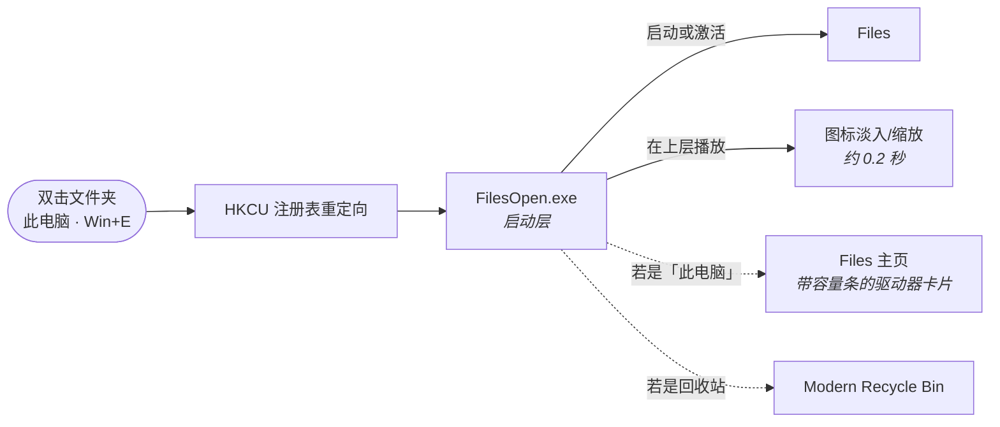

# Files Companion

**为 Files 补回启动动画，并让文件夹 / 驱动器 / 此电脑 / Win+E 都走 Files。**

> English README: [README.md](README.md)

## 它解决什么问题

[Files](https://github.com/files-community/Files) 为了打开够快，会**常驻后台**。
这带来一个副作用：打开文件夹只是**激活已有进程**，Windows 就**跳过了启动动画**，
窗口像是凭空出现。

**Files Companion** 在 Files 前面加了一层很薄的启动层，把动画补回来，
同时**不牺牲常驻带来的速度**。

| | 它提供了什么 |
|---|---|
| 🎬 | **启动动画** —— 恢复 Windows 那种图标淡入/缩放的开场效果 |
| 🧭 | **智能路由** —— 文件夹、驱动器、此电脑、`Win+E` 全部走 Files |
| 🏠 | **落对页面** —— 此电脑 / `Win+E` 落到 Files 的**主页**（有容量条的驱动器卡片），而不是画不出容量条的那个页面 |
| 🗑️ | **回收站联动** —— 可选把回收站交给 [Modern Recycle Bin](https://github.com/Dannyzzy/Modern-Recycle-Bin)，两个工具配套使用 |
| ↩️ | **完全可逆** —— 全部改动都在 `HKEY_CURRENT_USER`，卸载即还原 |

> **它不是 Files 插件。** Files 是自包含的 WinUI 应用，**没有插件/扩展接口** ——
> 我在它源码里查过 `IPlugin`、`PluginManager`、`ExtensionHost`、`ShellIntegration`、
> `RegisterAsDefault`，全部为 0。所以本项目以**配套工具**的形式发布，站在 Files 旁边，
> 而不是嵌进它里面。

## 安装

1. 到 [Releases](https://github.com/Dannyzzy/Files-Companion/releases/latest) 下载 `FilesCompanionSetup.exe`
2. 双击运行 —— **不需要管理员权限**
3. 按需勾选：
   - **启用启动动画 + 智能路由**（文件夹 / 驱动器 / 此电脑 / Win+E → Files）
   - **让回收站使用 Modern Recycle Bin**（若未安装，安装器会自动获取并静默安装；下载失败则打开下载页）
4. 完成，双击任意文件夹试试

**卸载**：运行 `%LOCALAPPDATA%\FilesCompanion\Uninstall.cmd`。
会删掉重定向、恢复默认打开方式、删除程序目录，不碰系统其它任何东西。

## 工作原理

**写入了哪些键**（全部在当前用户下，无需管理员）：

| 注册表键 | 值 |
|---|---|
| `Folder\shell\open\command` | `"…\FilesOpen.exe" "%1"` |
| `Folder\shell\explore\command` | 同上 |
| `Folder\shell\OpenWithFiles\command` | 同上 |
| `Directory\shell\OpenWithFiles\command` | 同上 |
| `Drive\shell\OpenWithFiles\command` | 同上 |
| `CLSID\{52205fd8-…}\shell\opennewwindow\command` | `"…\FilesOpen.exe"`（Win+E）|
| `CLSID\{20D04FE0-…}\shell\open\command` | `"…\FilesOpen.exe"`（此电脑）|
| `CLSID\{645FF040-…}\shell\open\command` | `"…\ModernRecycleBin\RecycleBin.exe"`（可选）|

会被 Explorer 内置委托抢走的键，额外写入 `DelegateExecute=""`。

## 两条安全准则

这是在做配套回收站时踩坑总结出来的，本项目同样遵守：

- **卸载器放在安装目录之外** —— Windows 不允许正在运行的程序删掉自己所在的目录
- **卸载时只在注册表值仍指向本程序的完整路径时才删除** —— 如果你自己另有一份
  `FilesOpen.exe`，它的配置不会被误删

## 系统要求

- Windows 10 / 11（64 位）
- 已安装 [Files](https://apps.microsoft.com/detail/9nghp3dx8hdx)（建议在它的高级设置里
  打开「设为默认文件管理器」，本工具在其之上补动画与额外路由）

## 已知说明

- 只有**新开的**窗口会走 Files；已经打开的 Explorer 窗口保持原样
- 本项目**不含 Files 的任何代码或资源**，只是启动它并把 shell 动词指向它
- Files 本身的许可为 MIT/MPL，归属
  [Files 社区](https://github.com/files-community/Files)

## 许可证

[MIT](LICENSE)

## 相关项目

**[Modern Recycle Bin](https://github.com/Dannyzzy/Modern-Recycle-Bin)** ——
为 Windows 11 重写的回收站（图片预览、还原到任意位置、复制出来）。
Files Companion 可以帮你一键装好并接上。
